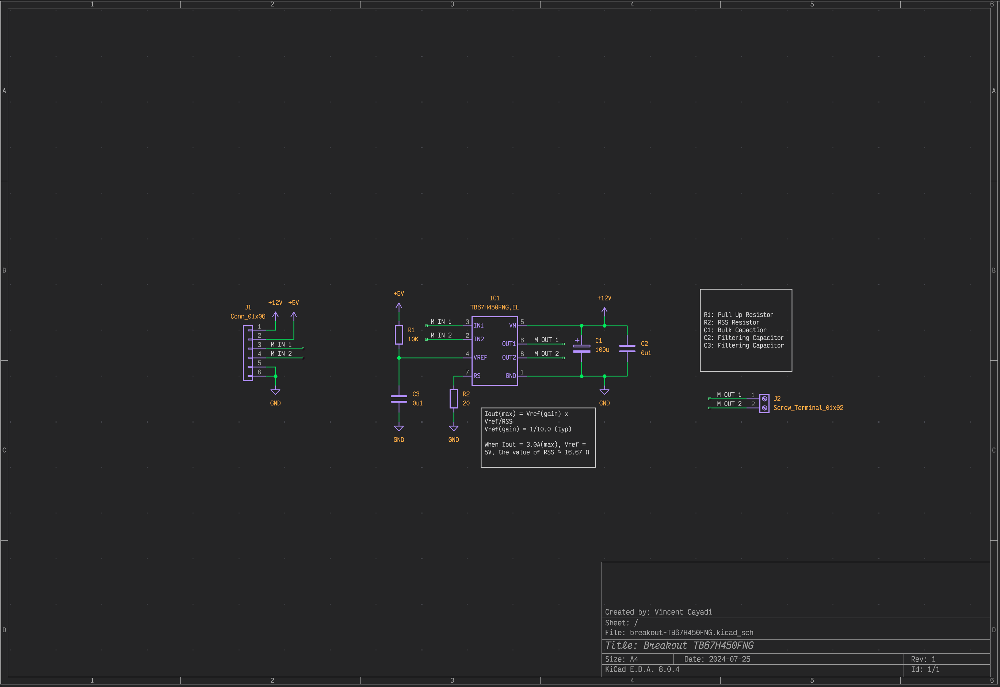

# breakout-TB67H450FNG

The TB67H450FNG Breakout/Evaluation Board is a custom-designed board for the Toshiba TB67H450FNG motor driver IC. The datasheet for this component can be found [here](https://toshiba.semicon-storage.com/info/TB67H450FNG_datasheet_en_20201126.pdf?did=65346&prodName=TB67H450FNG).

This board is ideal for low-power robotics applications that require minimal torque, with a maximum current rating of 3.0A and a typical current rating of 1.5A. While the board features Surface Mounted Devices (SMD) components, soldering is relatively straightforward, making it accessible to a wide range of users.

I have designed the components using [KiCAD EDA](https://www.kicad.org/), a free EDA software.

# Bill-Of-Materials

//Todo

# Schematic

